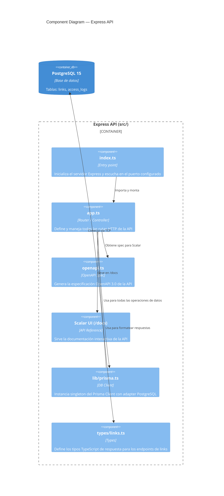

# C4 Model - Nivel 3: Component

```mermaid
C4Component
    title Component Diagram — Express API

    Container_Boundary(api, "Express API (src/)") {
        Component(index, "index.ts", "Entry point", "Inicializa el servidor Express y escucha en el puerto configurado")
        Component(app, "app.ts", "Router / Controller", "Define y maneja todas las rutas HTTP de la API")
        Component(openapi, "openapi.ts", "OpenAPI Spec", "Genera la especificación OpenAPI 3.0 de la API")
        Component(scalar, "Scalar UI (/docs)", "API Reference", "Sirve la documentación interactiva de la API")
        Component(prismaLib, "lib/prisma.ts", "DB Client", "Instancia singleton del Prisma Client con adapter PostgreSQL")
        Component(types, "types/links.ts", "Types", "Define los tipos TypeScript de respuesta para los endpoints de links")
    }

    ContainerDb(db, "PostgreSQL 15", "Base de datos", "Tablas: links, access_logs")

    Rel(index, app, "Importa y monta")
    Rel(app, prismaLib, "Usa para todas las operaciones de datos")
    Rel(app, openapi, "Obtiene spec para Scalar")
    Rel(app, scalar, "Sirve en /docs")
    Rel(app, types, "Usa para formatear respuestas")
    Rel(prismaLib, db, "Conecta via TCP")
```