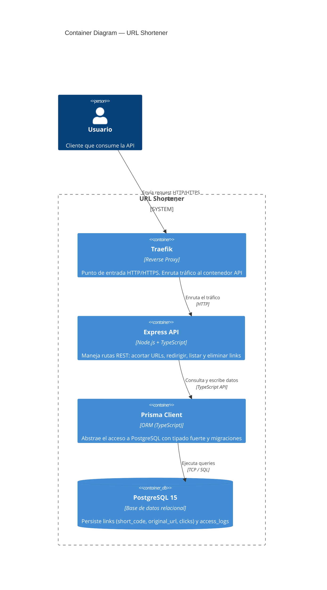

# C4 Model - Nivel 2: Container

```mermaid
C4Container
    title Container Diagram — URL Shortener

    Person(user, "Usuario", "Cliente que consume la API")

    System_Boundary(sys, "URL Shortener") {
        Container(traefik, "Traefik", "Reverse Proxy", "Punto de entrada HTTP/HTTPS. Enruta tráfico al contenedor API")
        Container(api, "Express API", "Node.js + TypeScript", "Maneja rutas REST: acortar URLs, redirigir, listar y eliminar links")
        Container(prisma, "Prisma Client", "ORM (TypeScript)", "Abstrae el acceso a PostgreSQL con tipado fuerte y migraciones")
        ContainerDb(db, "PostgreSQL 15", "Base de datos relacional", "Persiste links (short_code, original_url, clicks) y access_logs")
    }

    Rel(user, traefik, "Envía request HTTP/HTTPS", "REST")
    Rel(traefik, api, "Enruta el tráfico", "HTTP")
    Rel(api, prisma, "Consulta y escribe datos", "TypeScript API")
    Rel(prisma, db, "Ejecuta queries", "TCP / SQL")
```