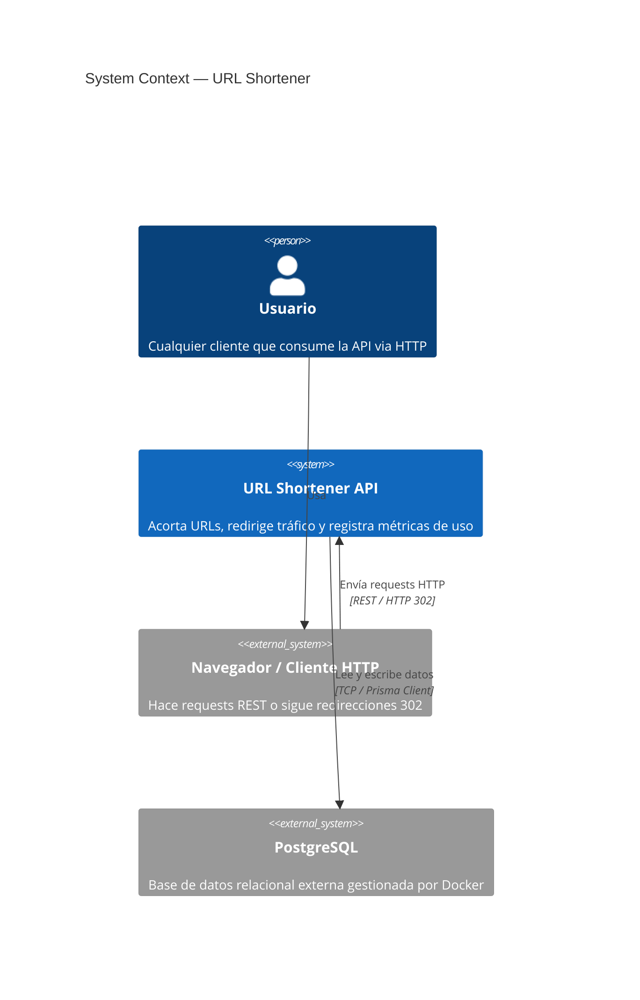

# C4 Model - Nivel 1: System Context

```mermaid
C4Context
    title System Context — URL Shortener

    Person(user, "Usuario", "Cualquier cliente que consume la API via HTTP")

    System(urlShortener, "URL Shortener API", "Acorta URLs, redirige tráfico y registra métricas de uso")

    System_Ext(browser, "Navegador / Cliente HTTP", "Hace requests REST o sigue redirecciones 302")
    System_Ext(postgres, "PostgreSQL", "Base de datos relacional externa gestionada por Docker")

    Rel(browser, urlShortener, "Envía requests HTTP", "REST / HTTP 302")
    Rel(urlShortener, postgres, "Lee y escribe datos", "TCP / Prisma Client")
    Rel(user, browser, "Usa")
```
